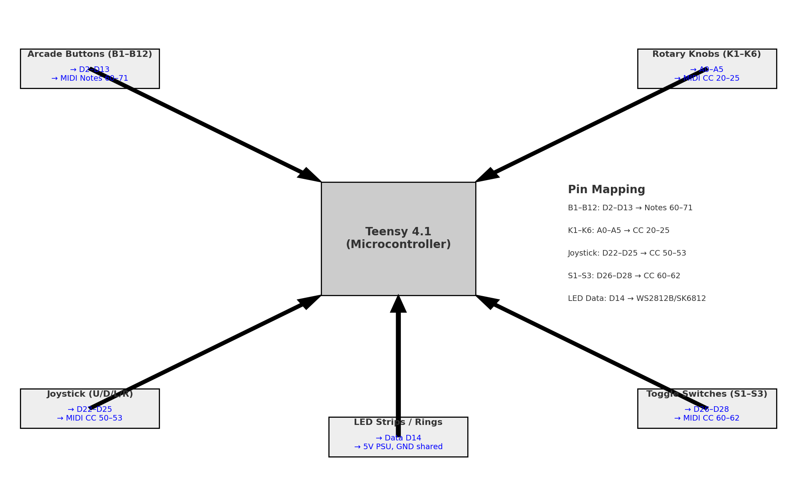
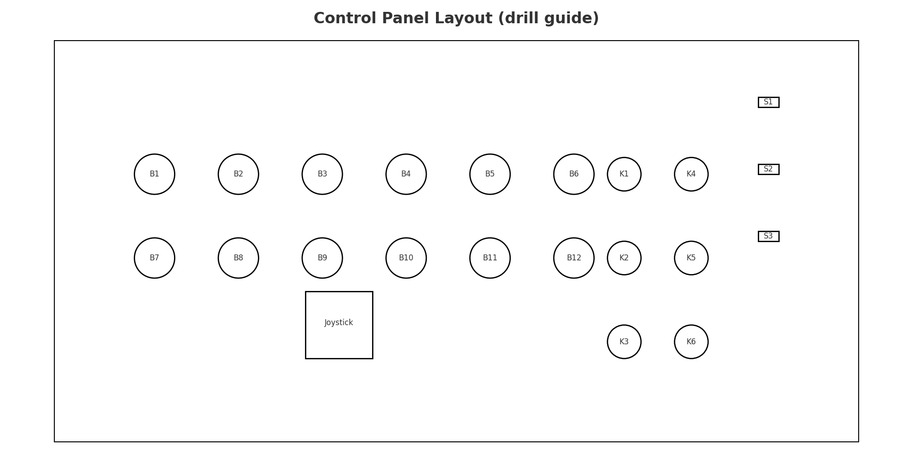
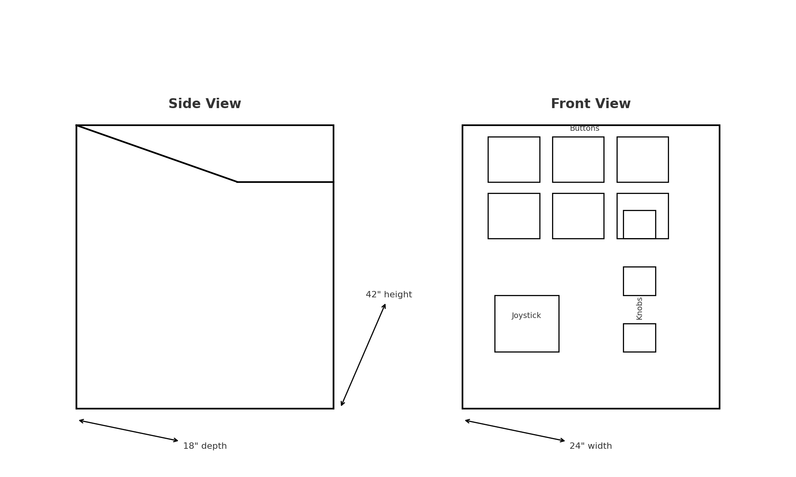

# Mystery Generative Melody Console — Full Project Plan (Teensy 4.1)

This document is a **build-ready plan** for your interactive, mysterious music station. It includes the concept, bill of materials, wiring, software mapping, cabinet construction, panel layouts, and testing checklist.

---

## 1) System Overview
```
[Buttons/Knobs/Joystick/Switches] → [Teensy 4.1 USB-MIDI] → [Raspberry Pi: Generative Engine] → [Audio + LEDs]
```
- **Teensy 4.1** reads inputs and sends MIDI Notes/CC to the Pi.
- **Raspberry Pi 4** runs Pure Data / SuperCollider / Python engine and can also drive advanced LED logic.
- **LEDs** run from a dedicated 5V PSU with common ground.

---

## 2) Wiring Diagram


**Pin map**
- **Buttons B1–B12 → D2–D13** (INPUT_PULLUP), send MIDI Notes 60–71  
- **Knobs K1–K6 → A0–A5** (10k linear pots), send MIDI CC 20–25  
- **Joystick U/D/L/R → D22–D25** (INPUT_PULLUP), send MIDI CC 50–53  
- **Switches S1–S3 → D26–D28** (INPUT_PULLUP), send MIDI CC 60–62  
- **LED data → D14** (to WS2812B/SK6812 via 330–470Ω series resistor)  
- **LED power → 5V PSU (10–15A)**, **GND shared** with Teensy

**Power best practices**
- 1000 µF electrolytic across LED 5V/GND near first pixel  
- Separate audio power/grounds from LED power runs  
- Star-ground back to the PSU where possible

---

## 3) Control Panel (Drill Guide)


**Panel size:** 24″ × 12″, mounted at ~30–35° tilt.  
Holes: **Buttons Ø1.2″**, **Knobs Ø1.0″**, **Switches 0.6″×0.3″**, **Joystick 2″ square.**

---

## 4) Cabinet (Dimension Sketch)


- **Height:** ~42″ overall, **Depth:** ~18″, **Width:** ~24″  
- ¾″ Baltic birch plywood, pocket-screw + glue  
- Back door with **foam gasket**; filtered vent if adding a fan  
- Rubber leveling feet; single **locking IEC** AC inlet to an internal power strip

---

## 5) Bill of Materials (core)
- Teensy 4.1 + USB cable  
- Raspberry Pi 4 (2–4 GB) + SD card + PSU  
- 12× LED arcade buttons + harnesses  
- 6× 10k linear potentiometers + knobs  
- 8-way arcade joystick  
- 3× SPST/SPDT toggle switches  
- WS2812B/SK6812 LED strip(s) (60–100 LEDs total)  
- 5 V LED PSU (10–15 A) + 1000 µF cap + 330–470 Ω resistor (LED data)  
- Speakers/amp, wiring, connectors, heatshrink, grommets, gasket foam  
- ¾″ plywood, ¼″ acrylic/polycarbonate panel cover, paint/vinyl

---

## 6) Software Mapping (Teensy → MIDI)
- **Buttons (B1–B12):** MIDI Notes 60–71 (also trigger secondary hidden rules in the Pi patch)  
- **Knobs (K1–K6):** MIDI CC 20–25 (tempo, cutoff, reverb mix, swing, density, volume… plus hidden ties)  
- **Joystick (U/D/L/R):** MIDI CC 50–53 (sequence length, scale, chaos lock, etc.)  
- **Switches (S1–S3):** MIDI CC 60–62 (mode/palette/drift)

> Keep the mysterious mapping **in software on the Pi** so you can iterate quickly without rewiring.

---

## 7) Teensy Firmware Outline (Arduino)
```cpp

// USB Type: MIDI (set in Tools menu)
#include <FastLED.h>

const int buttonPins[12] = {2,3,4,5,6,7,8,9,10,11,12,13};
const int knobPins[6]    = {A0,A1,A2,A3,A4,A5};
const int joyPins[4]     = {22,23,24,25};
const int switchPins[3]  = {26,27,28};
const int LED_PIN = 14;

void setup(){
  for(int i=0;i<12;i++) pinMode(buttonPins[i], INPUT_PULLUP);
  for(int i=0;i<4;i++)  pinMode(joyPins[i], INPUT_PULLUP);
  for(int i=0;i<3;i++)  pinMode(switchPins[i], INPUT_PULLUP);
  // init LEDs & MIDI here
}

void loop(){
  // scan buttons -> usbMIDI.sendNoteOn/Off(60+i,...)
  // read knobs -> usbMIDI.sendControlChange(20+k, value, 1);
  // scan joystick -> usbMIDI.sendControlChange(50+d, 127, 1);
  // scan switches  -> usbMIDI.sendControlChange(60+s, state?127:0, 1);
}

```

---

## 8) Pi Generative Engine (Pure Data / SuperCollider / Python)
- **Input layer:** MIDI in from Teensy → router that fan-outs to primary + secret secondary mappings  
- **Sequence core:** 8–16 steps, probability per step, global density, drifted tempo/swing  
- **Scale mapping:** real-time remap to Major/Minor/Pentatonic/Diminished/Exotic  
- **Auto-mutation:** every 2–4 min change 1–2 parameters  
- **Idle mode:** downshift to ambient, slow LED fades after 30 s of inactivity

---

## 9) Build Sequence
1. **Bench test** Teensy inputs + MIDI on your laptop  
2. Prototype Pi patch; verify messages drive sound + lights  
3. Cut cabinet panels; dry fit; then paint/finish  
4. Drill panel using the guide; mount controls  
5. Wire harnesses, route to Teensy, label inside  
6. Install LEDs; inject power at both ends for >3 m strips  
7. Mount Pi, PSU, speakers; dress cables; add gasketed back  
8. **Soak test** 4–6 hrs; add dust if you can; fix any heat/noise issues

---

## 10) Safety & Reliability
- IEC inlet with fuse; secure all PSU terminals with ferrules  
- Strain relief on all external cables  
- Keep audio lines isolated from LED power; twist LED data with GND  
- Bring spare buttons/joystick microswitch, fuses, and a small toolkit to the event

---

## 11) Appendix — Exact Pin/Message Map
| Control | Teensy Pin | MIDI Message |
|---|---|---|
| B1–B12 | D2–D13 | Note 60–71 |
| K1–K6 | A0–A5 | CC 20–25 |
| Joystick U/D/L/R | D22/D23/D24/D25 | CC 50–53 |
| Switch S1–S3 | D26/D27/D28 | CC 60–62 |
| LED Data | D14 | WS2812B/SK6812 |

---

**Files referenced in this plan:**  
- Wiring diagram: `teensy_wiring_diagram.png`  
- Control panel layout: `control_panel_layout.png`  
- Cabinet sketch: `cabinet_front_side.png`  
